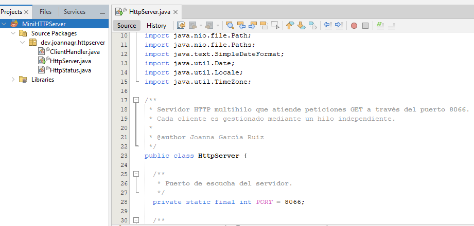
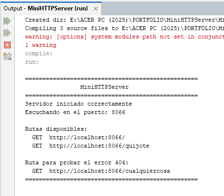
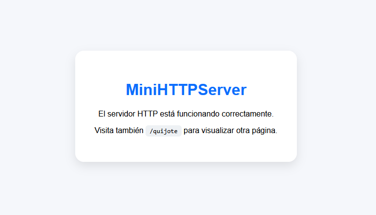
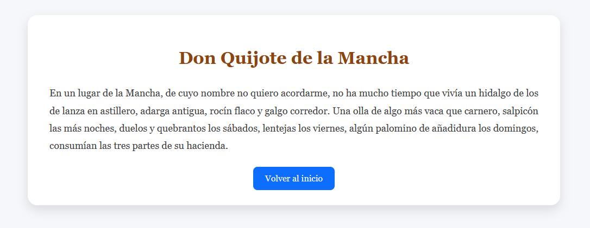
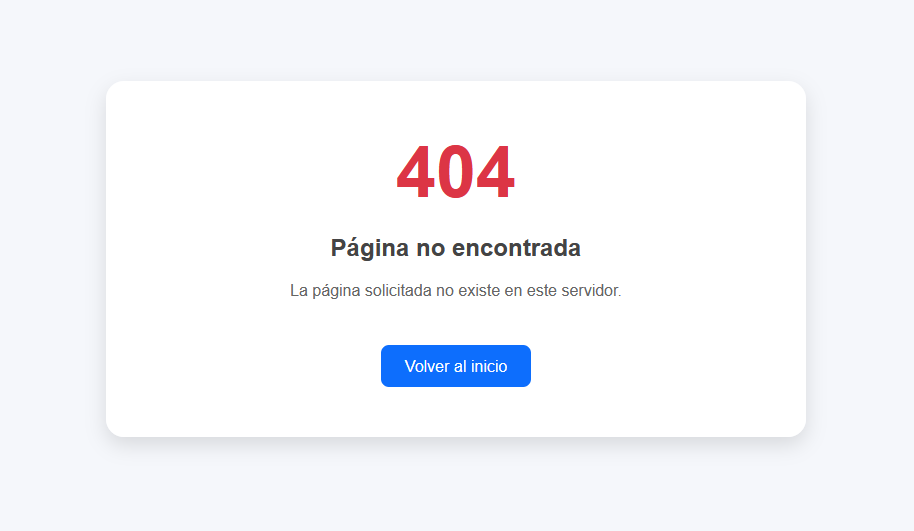

<p align="center">
    
</p>

# MiniHTTPServer


MiniHTTPServer es un servidor HTTP desarrollado en **Java** que permite atender peticiones **GET** mediante sockets TCP y responder con páginas HTML estáticas.

El proyecto ha sido desarrollado como parte del **CFGS de Desarrollo de Aplicaciones Multiplataforma (DAM)** con el objetivo de poner en práctica la programación de aplicaciones cliente-servidor, el uso de sockets, la comunicación mediante el protocolo HTTP y la programación concurrente utilizando hilos.

Además de la funcionalidad solicitada en la práctica original, el proyecto ha sido refactorizado para mejorar la organización del código, separar los recursos HTML de la lógica Java y facilitar su mantenimiento.

---

## Índice

- Capturas
- Características
- Tecnologías utilizadas
- Arquitectura
- Estructura del proyecto
- Objetivos
- Instalación
- Funcionamiento
- Mejoras futuras
- Autor

---

# Capturas

## Desarrollo del servidor



---

## Ejecución del servidor



---

## Página principal



---

## Página del Quijote



---

## Página de error 404



---

## Características

- Implementación de un servidor HTTP desde cero utilizando sockets.
- Gestión de conexiones TCP mediante `ServerSocket` y `Socket`.
- Atención concurrente de múltiples clientes mediante hilos.
- Procesamiento de peticiones HTTP de tipo **GET**.
- Respuesta con páginas HTML estáticas.
- Gestión de errores HTTP 404.
- Registro de peticiones y respuestas mediante consola.
- Separación de los recursos HTML del código Java.
- Código refactorizado y documentado mediante JavaDoc.

---

## Tecnologías utilizadas

| Tecnología | Descripción |
|------------|-------------|
| Java SE 17 | Lenguaje principal |
| TCP/IP | Comunicación entre cliente y servidor |
| HTTP | Protocolo de aplicación |
| Java Sockets | Comunicación de red |
| Multithreading | Atención simultánea de clientes |
| Apache NetBeans | Entorno de desarrollo |
| Apache Ant | Construcción del proyecto |

---

## Arquitectura

MiniHTTPServer sigue una arquitectura sencilla basada en la separación de responsabilidades.

- **HttpServer**: inicia el servidor, acepta conexiones y coordina el procesamiento de las peticiones.
- **ClientHandler**: atiende cada cliente en un hilo independiente.
- **HttpStatus**: centraliza las líneas de estado utilizadas por el protocolo HTTP.
- **resources**: contiene las páginas HTML servidas por la aplicación.

Esta organización facilita el mantenimiento del código y mejora su legibilidad respecto a la práctica original.

### Flujo de funcionamiento

```text
                    Cliente (Navegador)
                            │
                    Petición HTTP GET
                            │
                            ▼
                     ┌─────────────────┐
                     │   HttpServer    │
                     └─────────────────┘
                            │
                Acepta la conexión TCP
                            │
                            ▼
                 ┌────────────────────┐
                 │   ClientHandler    │
                 │      (Thread)      │
                 └────────────────────┘
                            │
              Procesa la petición HTTP
                            │
                            ▼
                Resuelve la ruta solicitada
                            │
            ┌───────────────┼───────────────┐
            │               │               │
            ▼               ▼               ▼
      index.html      quijote.html      404.html
            │               │               │
            └───────────────┼───────────────┘
                            │
                    Genera la respuesta
                            │
                            ▼
                 HTTP 200 OK / 404 Not Found
                            │
                            ▼
                    Cliente (Navegador)
```

---

## Estructura del proyecto

```text
MiniHTTPServer
│
├── docs
│   └── images
│       ├── banner.png
│       ├── httpserver.png
│       ├── consola.png
│       ├── index.png
│       ├── quijote.png
│       └── 404.png
│
├── MiniHTTPServer
│   ├── nbproject
│   ├── resources
│   │   ├── 404.html
│   │   ├── index.html
│   │   └── quijote.html
│   │
│   ├── src
│   │   └── dev
│   │       └── joannagr
│   │           └── httpserver
│   │               ├── ClientHandler.java
│   │               ├── HttpServer.java
│   │               └── HttpStatus.java
│   │
│   ├── build.xml
│   └── manifest.mf
│
├── .gitignore
├── LICENSE
└── README.md
```

---

## Objetivos

Este proyecto ha sido desarrollado con el objetivo de consolidar conocimientos sobre:

- Programación de aplicaciones cliente-servidor.
- Comunicación mediante sockets TCP.
- Funcionamiento básico del protocolo HTTP.
- Programación concurrente utilizando hilos.
- Organización y refactorización de proyectos Java.
- Separación entre la lógica de negocio y los recursos estáticos.
- Documentación del código mediante JavaDoc.

---

## Instalación

### Requisitos

Antes de ejecutar el proyecto es necesario disponer de:

- Java 17
- Apache NetBeans (o cualquier IDE compatible con proyectos Ant)

---

### Clonar el repositorio

```bash
git clone https://github.com/joannagr-dev/minihttpserver.git
```

---

### Abrir el proyecto

Abrir el proyecto desde Apache NetBeans.

Compilar el proyecto y ejecutar la clase:

```text
HttpServer.java
```

---

### Acceder al servidor

Una vez iniciado el servidor estará disponible en:

```text
http://localhost:8066
```

También pueden probarse las siguientes rutas:

```text
http://localhost:8066/quijote
```

```text
http://localhost:8066/cualquiercosa
```

La última ruta mostrará la página de error **404 Not Found**.

---

## Funcionamiento

Al iniciarse, el servidor queda a la espera de conexiones TCP en el puerto **8066**.

Cuando un cliente realiza una petición HTTP:

1. El servidor acepta la conexión mediante un `ServerSocket`.
2. Se crea un hilo independiente (`ClientHandler`) para atender al cliente.
3. Se procesa la petición HTTP recibida.
4. Se identifica la ruta solicitada.
5. Se carga el recurso HTML correspondiente desde la carpeta `resources`.
6. Se envía la respuesta HTTP al cliente con el código de estado adecuado.
7. La conexión se cierra una vez enviada la respuesta.

Durante la ejecución, el servidor registra en la consola las conexiones recibidas, la ruta solicitada y el código HTTP devuelto.

---

## Mejoras futuras

Algunas mejoras que podrían incorporarse en futuras versiones del proyecto:

- Soporte para otros métodos HTTP como **POST** o **HEAD**.
- Servicio de archivos CSS, JavaScript e imágenes.
- Gestión de cabeceras HTTP adicionales.
- Soporte para tipos MIME.
- Registro de actividad mediante archivos de log.
- Configuración del puerto mediante fichero de propiedades.
- Uso de un pool de hilos (`ExecutorService`) en lugar de crear un hilo por cliente.

---

## Autor

**Joanna García Ruiz**

Estudiante del CFGS de Desarrollo de Aplicaciones Multiplataforma (DAM).

Este proyecto ha sido desarrollado con fines formativos para practicar la programación de servidores HTTP utilizando sockets, el protocolo HTTP y la programación concurrente en Java.